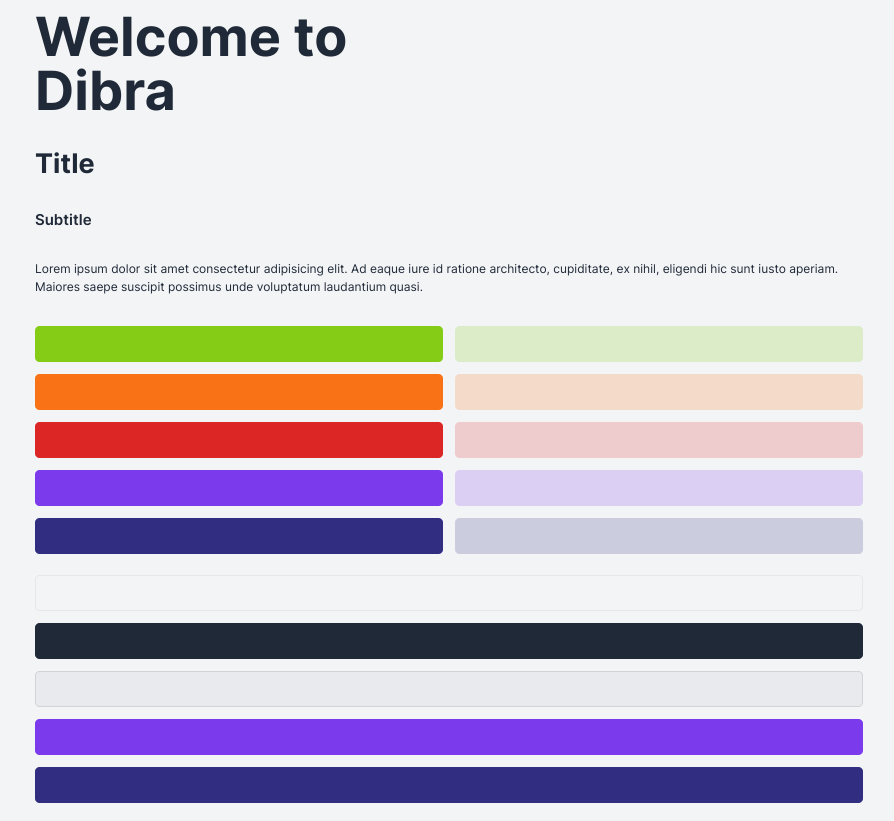

# Design Elements

## Typography

> | Element   | Size   | Tailwind property |
> | --------- | ------ | ----------------- |
> | Hero      | `72px` | `text-7xl`        |
> | Title     | `36px` | `text-4xl`        |
> | Subtitle  | `20px` | `text-xl`         |
> | Paragraph | `16px` | `text-base`       |

> `max-width`: 1280px / max-w-7xl

## Color Palette

### Neutral Colors

> | Color       | rgb/a value                | Tailwind property |
> | ----------- | -------------------------- | ----------------- |
> | white       | `rgb(243, 244, 246, 1)`    | `bg-gray-100`     |
> | black       | `rgb(31, 41, 55, 1)`       | `bg-gray-800`     |
> | transparent | `rgba(209, 213, 219, 0.3)` | `g-gray-300/30`   |
> | border      | `rgba(3 7 18, 0.1)`        | `border-gray-950` |

---

### Color Variants

> | Color     | rgba value             | Tailwind property |
> | --------- | ---------------------- | ----------------- |
> | green     | `rgb(132, 204, 22, 1)` | `bg-lime-500`     |
> | orange    | `rgb(249, 115, 22, 1)` | `bg-orange-500`   |
> | red       | `rgb(220, 38, 38, 1)`  | `bg-red-600`      |
> | purple    | `rgb(124, 58, 237, 1)` | `bg-violet-600`   |
> | dark blue | `rgb(149, 46, 129, 1)` | `bg-indigo-900`   |

---

### Color Variants Transparent

> | Color     | Opacity | rgba value               | Tailwind property  |
> | --------- | ------- | ------------------------ | ------------------ |
> | green     | 20%     | `rgb(132, 204, 22, 0.2)` | `bg-lime-500/20`   |
> | orange    | 20%     | `rgb(249, 115, 22, 0.2)` | `bg-orange-500/20` |
> | red       | 20%     | `rgb(220, 38, 38, 0.2)`  | `bg-red-600/20`    |
> | purple    | 20%     | `rgb(124, 58, 237, 0.2)` | `bg-violet-600/20` |
> | dark blue | 20%     | `rgb(149, 46, 129, 0.2)` | `bg-indigo-900/20` |
